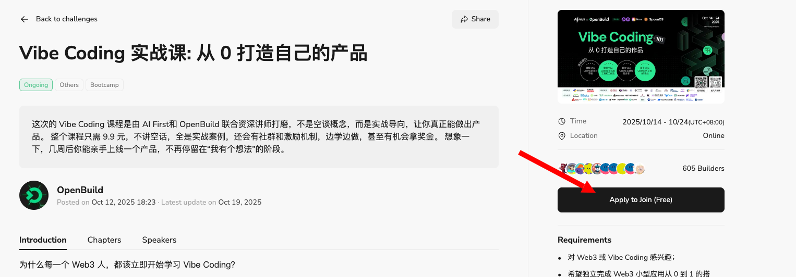
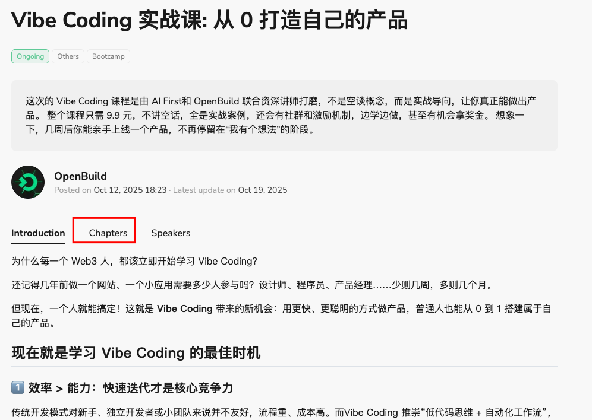
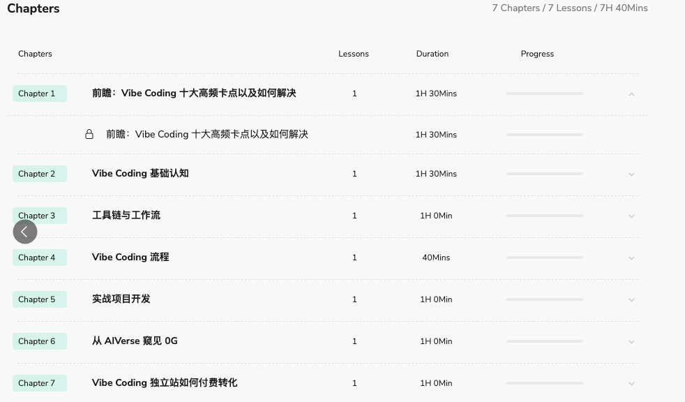

    <h1>Vibe Coding 实战课！</h1>
    
零基础也能上手，Vibe Coding 实战课，带你做出第一个可运行产品

 

## 介绍

本次「Vibe Coding 实战课」由 [AIFirst]() 和 [OpenBuild](https://openbuild.xyz/) 共同发起。通过系统化的学习和实战训练，理解 Vibe Coding 的概念和技巧，并将其转化为真正的开发能力。这不仅仅是一门课程，更是一次开发思维的全面升级。Web3。 [了解更多](https://mp.weixin.qq.com/s/ucyd7PB-TC_VUhpdNMdFaw)

 

## ⭐ 核心亮点 ⭐

- ✅ 四位导师联合授课：集结 Cell 细胞、Panda、崔棉大师、张晋涛四位专家的独特经验
- ✅ 覆盖完整工作流：从AI工具链配置、Prompt 工程到大型项目管理
- ✅ 真实项目驱动：在实战中掌握解决十大卡点的系统方法
- ✅ 开发者社群支持：与同行持续交流，获得导师针对性指导

 

## 立即报名

- 课程时间：2025年10月14日 - 10月24日
- 报名费：9.9元
- 报名链接：https://lpk4f4f4yzdqstkt.mikecrm.com/7qtUoJ1 (**报名请认真填写邮箱，邮箱后面要用**）

    

报名成功后打开课程链接：https://openbuild.xyz/learn/challenges/2080494935 点击 `Apply to Join` 按钮激活课程。（**会提醒登录网站，注意一定要使用报名时使用的邮箱登录**)

    

然后会出现以下情况(可以刷新下页面)：

- 1️⃣ 【Under review 】→ 后台审核中，耐心等待下或联系小助手(**微信：i599wen**)审核
- 2️⃣ 【Applied】→ 审核通过啦，可正常观看课程

审核通过后，可以选择 `Chapters` 开始观看课程👇

    

 

    

 

## 课程安排

### Lesson 1 · 10月14日（周二）

- 主题： Vibe Coding 基础认知
- 讲师： 
    - [张晋涛](https://x.com/zhangjintao9020)  -  Microsoft MVP，PyCon China 组织者
    - [崔棉大师](https://x.com/MasterCui)  -  清华 x-lab 校链创新教育计划区块链讲师
    - [Cell细胞](https://x.com/cellinlab)  -  超级个体社区物种库发起人，小火炉播客创始人
    - [Panda](https://x.com/CodeMorePanda)  -   新兴社 N 行业的 Vibe Coding 实践营讲师

### Lesson 2 · 10月16日（周四）

- 主题： 工具链与工作流
- 讲师： [张晋涛](https://x.com/zhangjintao9020)  -  Microsoft MVP，PyCon China 组织者

### Lesson 3 · 10月18日（周六）

- 主题： Vibe Coding 流程
- 讲师： [Panda](https://x.com/CodeMorePanda) -  新兴社 N 行业的 Vibe Coding 实践营讲师

### Lesson 4 · 10月20日（周一）

- 主题： 实战项目开发
- 讲师： [崔棉大师](https://x.com/MasterCui)   -  清华 x-lab 校链创新教育计划区块链讲师

### Lesson 5 · 10月22日（周三）

- 主题： 从 AIVerse 觅见 0G
- 讲师： [Wei](https://x.com/0G_labs) -  0G 币圈原型码写工程师

### Lesson 6 · 10月24日（周四）

- 主题： Vibe Coding 独立站如何付费转化
- 讲师： [Cell细胞](https://x.com/cellinlab) -  超级个体社区物种库发起人，小火炉播客创始人

 

## 作业提交

### 首次提交

1. `Fork` 本仓库，然后 `clone` 到你的本地。
2. 进入 [students](./students) 文件夹，创建以你的名字(github用户名)命名的文件夹 `YourName`。
3. 复制 [Template.md](./Template.md) 文件到刚才创建的文件夹里面，并将文件重命名为你的名字：`YourName.md`。
4. 打开 `students/YourName/YourName.md` 文件，根据文档指引填写你的信息并保存。(**可以参考 [phoouze.md](./students/phoouze/phoouze.md) 相对仓库的文件位置**)
5. 提交一个 PR 到本仓库，等待合并。| [如何提交PR？](https://juejin.cn/post/7021727244124962846)

### 完成作业

每个课程章节对应一个 **task**，共六章对应 task1-task6, 可以在 [tasks](./tasks) 文件夹中复制对应的章节 task1-6 到你的文件夹 `students/YourName` 中，然后完成作业并提交 PR(如果作业包含多个文件，可以以文件夹的形式命名task1-6)。 **注意：不要修改别人文件夹的内容。**

提交时限：2025年10月14日 - 10月30日

 

| 章节                            | 作业                      | 
|---------------------------------|---------------------------|
| Vibe Coding 基础认知            | [task1](./tasks/task1.md) |
| 工具链和工作流                  | [task2](./tasks/task2.md) |
| Vibe Coding 流程                | [task3](./tasks/task3.md) |
| 实战项目开发                    | [task4](./tasks/task4.md) |
| 从 AIVerse 觅见 0G              | [task5](./tasks/task5.md) |
| Vibe Coding 独立站如何付费转化  | [task6](./tasks/task6.md) |

