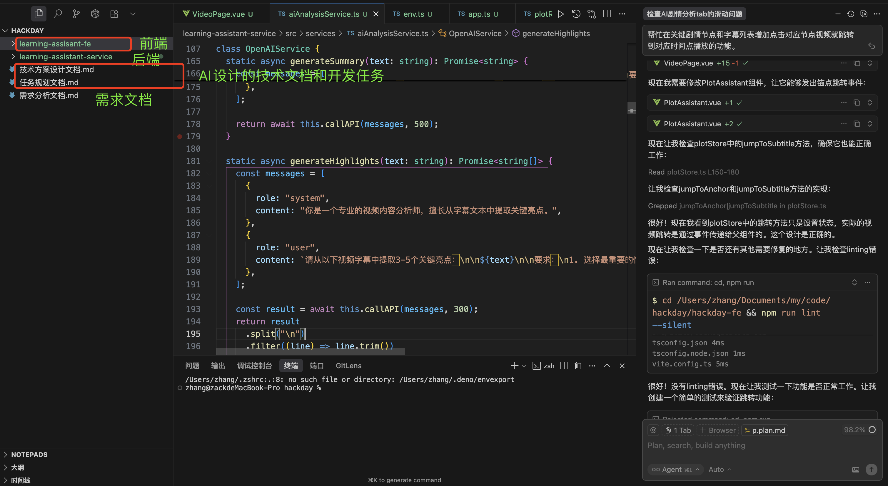

## 第一节课：Vibe Coding 基础认知

1. 描述下 MVP 场景描述

   知识类学习视频，往往需要反复回看某些片段去学习，为方便回看，根据字幕信息生成视频总结、概要，并标记关键视频节点（如关键知识点等）生成跳转锚点，方便快速回看。

2. 工作流设计思路

   1. 初步告诉 AI 我的 MVP 场景描述，共同制定产品方案
   2. 根据产品方案让 AI 帮我生成技术方案文档和开发任务文档
   3. 人工 review 技术方案文档和开发任务
   4. 根据技术方案文档和开发任务文档逐步开发任务，每一步完成都需要我确认再进行下一步
   5. AI 完成测试用例执行
   6. 人工测试及 review 代码

3. AI 生成的代码样板截图或链接
   
