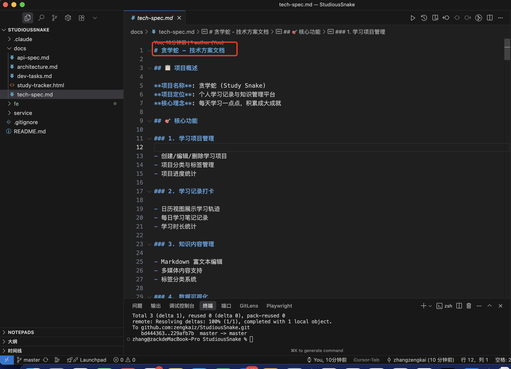
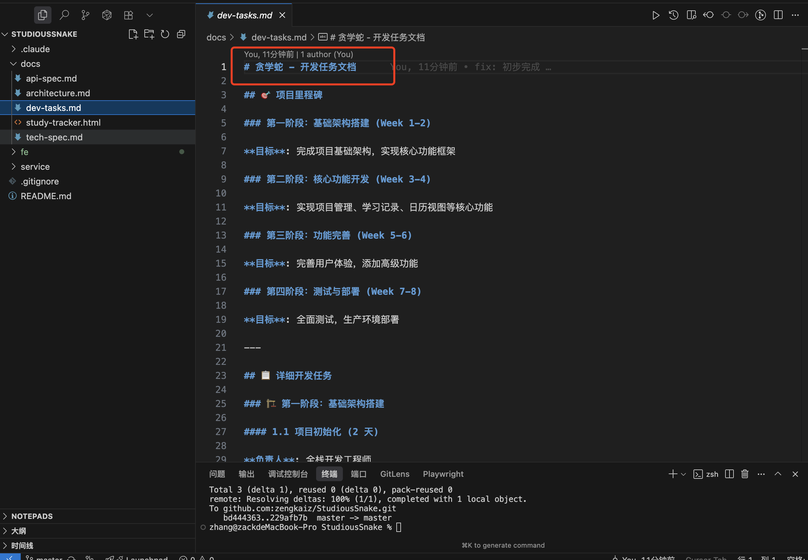
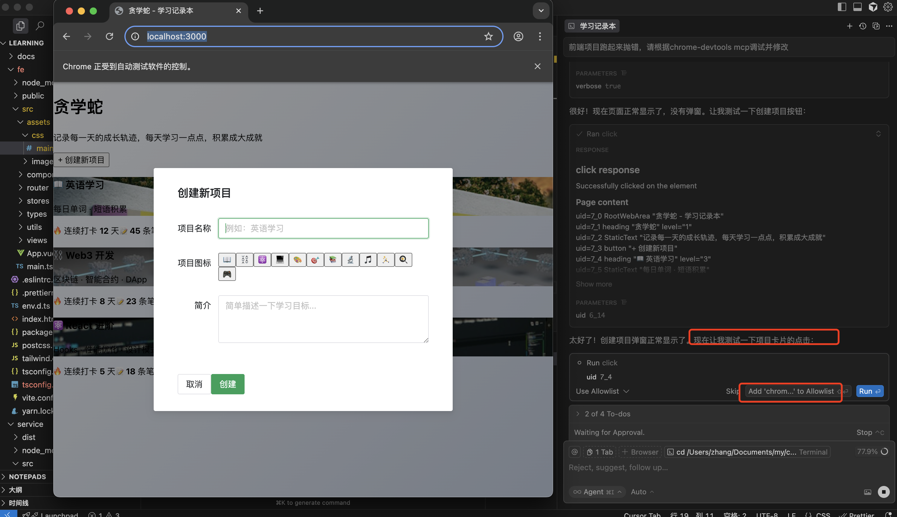

## 第三节课：Vibe Coding 流程

1. 完整的项目代码仓库
   [贪学蛇](https://github.com/zengkaiz/StudiousSnake)
2. 项目说明文档（使用 VibeSpecs 流程的截图）
   详见仓库 README  
   VibeSpecs 流程：需求文档 -> AI 设计图 -> AI 指定技术方案和开发任务 -> 人工 review 修正 -> 按开发任务逐步开发（风险可控，完成每一步人工 review）
   
   

3. BUG 解决过程的记录
   下面是使用 chrome-devtools 调试项目 bug 的过程截图：  
   
