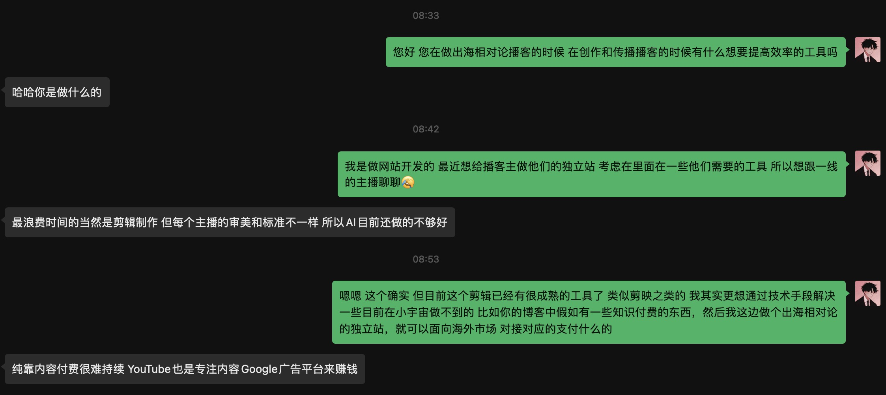

## 第六节课：VibeCoding 独立站如何付费转化

1. 赚钱第一步，先和客户聊，去小宇宙平台尝试加 5 位播客主微信，问他们有哪些地方需要创作和传播效率优化工具？
   
   尝试聊了几个，有的没回复，也有反向比较好的，只是我目前技术不够，没有深入去聊。
2. 最小 MVP，找一个 500-2000 订阅人数的播客，用 AI 定制化开发一个个性化播客展示站点
   代码：见当前文件下 podcast  
   基本模块如下图：  
   
   
3. 加 2 种目标播客的播客主，试着向他推销你做的站点，尝试问是否愿意付费优化和部署
   
